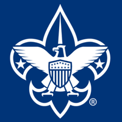
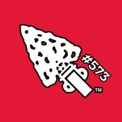

<!-- prettier-ignore -->

{}  
  As of September 7th, 2026, Our weekly net will be held on the **WB9AGX** repeater with a frequency of **147.390 MHz** and a **PL tone** of **131.8**.  
  The **145.290 MHz** repeater (*formerly N9OCB*) located at the Saint Joseph County Fairgrounds is currently under maintenance.

  Thank you for your continued support. 73.  
  *George Palmer* | KD9GXA  
  President
{}

{}

<!-- prettier-ignore -->
{}  
{.display-6}

<!-- prettier-ignore -->

  <a {} href="Services/">
    How We Can Help
  </a>
  <a {}
    href="Volunteer/">
    Want to Volunteer?
  </a>

{}
{}

{}
## St. Joseph Co. Radio Communications Volunteers

We are a 501(c)(3) Non-profit organization founded in March 10th, 2009. We volunteer amateur radio communications for public community events, emergency communications and severe weather reporting.
{}

{}
## Our Mission

We believe in serving others, in promoting amateur radio in the community and providing the training and support required to become an amateur radio operator and emergency communications provider.
{}

{}
## Monthly Meeting

Our monthly meetings are held on the third monday of each month at 6:30 PM EST. Located at Riverpark branch Library 2022 Mishawaka Avenue in South Bend, IN.
{}

{}
## Weekly Net

Our weekly net is held at 7:00 PM EST on the **WB9AGX repeater on 147.390 with a PL tone of 131.8**. All amateur radio operators are welcome to participate.
{}

{}
## Siren Test Net

Siren test Nets have resumed and occur monthly on the first Thursday. The net will begin around 11:30 AM EST on the **WB9AGX repeater on 147.390 with a PL tone of 131.8**. We encourage all amateurs to check-in and report if they hear the sirens or not. It helps to know the siren number or
general location when reporting. It also helps to have reports from family members as well. If you can not check but heard ot did not hear the sirens.  
We will forward any reports received to the county EMA. Click below to send a Siren Report.

<!-- prettier-ignore -->

  <a {} href="mailto:SJRCV@yahoo.com?subject=Siren%20Report" target="_blank" >
    📧 Email Siren Report
  </a>

{}

<!-- {}

{}

The Goldydocs UI now shows chair size metrics by default.

Please follow this space for updates!

{}

{}

We do a [Pull Request](https://github.com/google/docsy-example/pulls)
contributions workflow on **GitHub**. New users are always welcome!

{}

{}

For announcement of latest features etc.

{}

{} -->

{}

{}

   
*Hosted by LaSalle Council, Scouting America & Sakima Lodge, Order of the Arrow*

**Iron Horse Festival**  
at **Potato Creek State Park**  
on **October 17th, 2026**

## What is the Iron Horse event?

  We are **tentatively** looking for volunteers to help guide kids (generally about 8-12 years old) on fox hunts, and provide kids an opportunity to talk on an HF radio. We will collaborate with a licensed amateur radio operator and a certified merit badge counselor to provide basic concepts of radio communications and then allow the kids to either fox hunt or talk on the radio. We will be trying to establish 2 fox transmitters for the event and encourage volunteers to bring tape measure Yagi antennas and a cheap radio **you are comfortable with** to help guide kids to the fox transmitter. Its a rewarding event that helps show both the youth and adults in the community that amateur radio is a healthy and growing community.

---

## Volunteers Needed!  

  We're using SignUp (the leading online SignUp and reminder tool) to organize our upcoming SignUps.

  Here's how it works in 3 easy steps:

  1) Click the button below to volunteer using SignUp.
  2) Review the options listed and choose the spot(s) you like.
  3) Sign up! It's Easy - you will NOT need to register an account or keep a password on SignUp.

  <!-- prettier-ignore -->
  

       
  

  **Note:** *SignUp does not share your email address with anyone. If you prefer not to use your email address, please contact me and I can sign you up manually.*
{}

{}

{}

  {}

### What is Lights of Liberty?

  Lights of Liberty is a community fundraiser presented by the North Liberty Area Chamber of Commerce and powered by local sponsors and volunteers. Inspired by those “Hallmark-movie” hometown celebrations, we’re transforming the Stellar Trail at North Liberty Elementary into a twinkling winter walk.
  
  For more information check out their website:

### How will Amateur Radio volunteers improve the event?

  We will be focused on relaying information and trail safety. We also are planning on a unique Mesh-based solution similar to Santa Net to help create a magical experience for children.

  Please join us and help grow our Amateur Radio community!

  {}

  <!-- {} -->

  {}
  We're using SignUp (the leading online SignUp and reminder tool) to organize our upcoming SignUps.

  Here's how it works in 3 easy steps:

  1) Click the button below to volunteer using SignUp.
  2) Review the options listed and choose the spot(s) you like.
  3) Sign up! It's Easy - you will NOT need to register an account or keep a password on SignUp.

  <!-- prettier-ignore -->
  

     
  

  
  **Note:** *SignUp does not share your email address with anyone. If you prefer not to use your email address, please contact me and I can sign you up manually.*
  {}

{}

{}

⚠️🚧 Stay tuned for more information! 🚧⚠️

This website is actively under construction.

{}
